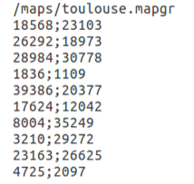
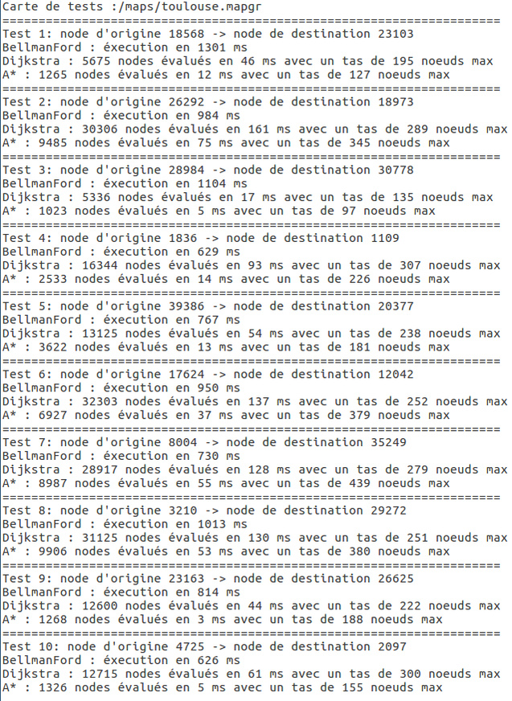
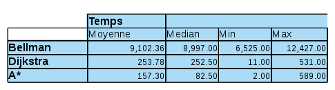
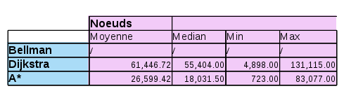
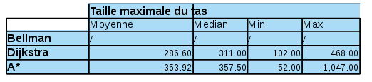
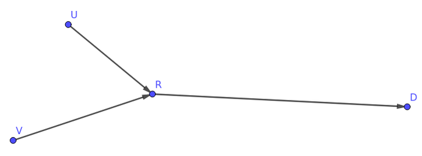
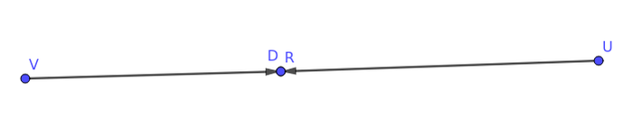
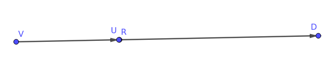

&nbsp;

&nbsp;

&nbsp;

&nbsp;

&nbsp;

&nbsp;


# Introduction 

L'objectif de ce bureau d'étude est de nous faire découvrir les méthodes modernes de programmation utilisées en entreprise au travers de l'implémentation de deux algorithmes de recherche de chemin. 
Nous commençons par construire les structures de données nécessaires à leur implémentation (file de priorité, classes objets) pour ensuite implémenter un algorithme de Dijkstra et un algorithme d'A\*. Enfin nous écrivons des tests unitaires pour vérifier le fonctionnement de nos solutions et des tests de perfomance permettant de comparer les différents algorithmes étudiés.

Pour terminer ce bureau d'étude nous sommes confrontés à un problème de graphes pour lequel nous devons proposer un traitement algorithmique cohérent.

 \newpage 

# Documents de conception

Afin de nous familiariser avec la librairie Java qui nous est fournie, nous avons réalisé un graphe UML des différentes classes à utiliser.  
&nbsp;


\ 

\newpage 
# Classes développées

## Labels

L'utilisation des algorithmes de Dijskstra et A\* nécessite la création de classes `Label` afin d'attribuer des propriétés aux nœuds qui sont mises à jour au cours du parcours du graphe.

### DijkstraLabel

Le `Label` pour l'algorithme de Dijkstra est assez succinct, il contient quatre membres :

* le nœud associé au label
* le nœud parent, par lequel on arrive au nœud courant dans le parcours du graphe
* le coût total pour arriver au nœud courand
* un booléen qui représente le marquage des nœuds


```java
// ... classe Label
public boolean marked ;
public Node parent ;
public double cost ;
public Node me;
```

Ainsi pour comparer des `Label` on peut se contenter d'implémenter `Comparable<Label>` et de comparer le membre `cost` :
```java
// ... classe Label
@Override
public int compareTo(Label label) {
        Double val = this.cost - label.cost;
        return val.intValue();
}
```

### AstarLabel

Pour implémenter cette classe, nous voulions à la base hériter de `DijkstraLabel` mais cela nous empêché d'implémenter la comparaison entre deux labels de manière satisfaisante. C'est pourquoi nous avons dupliqué le code et rajouté un membre à la classe `DijkstraLabel` qui est de toute façon très petite.
Les membres sont alors :
```java
// ... classe AstarLabel
public boolean marked ;
public Node parent ;
public double cost ;
public Node me;
// Nouveau membre pour le coût heuristique
public double estimatedGoalDistance ;
```

La comparaison est elle implémentée ainsi :
```java
@Override
public int compareTo(AstarLabel label) {
    return (int) Math.signum((this.cost + this.estimatedGoalDistance) 
						- (label.cost + label.estimatedGoalDistance));
}
```

## Dijkstra

Notre algorithme est implémenté ainsi :

On commence par initialiser quelques variables utiles, notamment on initialise les `Label` à `null` pour ne pas consommer de la mémoire inutilement.

```java
ShortestPathData data = getInputData();
ShortestPathSolution solution = null;
// Retrieve the graph.
Graph graph = data.getGraph();
final int nbNodes = graph.size();
boolean done = false ;
// Initialize array of distances.
Map<Node, Label> labels = new HashMap<>(nbNodes);
```

Ensuite on crée le `Label` de l'origine et la file de priorité et on ajoute ledit `Label` à la file.

```java
Label labi = new Label(data.getOrigin(), null, false, 0.0);
labels.put(data.getOrigin(),labi);
// Le tas
BinaryHeap<Label> tas= new BinaryHeap<>();
tas.insert(labels.get(data.getOrigin()));
// Ces deux variables permettent de renvoyer des statistiques en sortie de l'algorithme.
int nodeEvaluated = 0;
int maxHeapSize = 0;
```

On peut maintenant exécuter l'algorithme : on boucle sur `!done` et on sort de la boucle quand la file de priorité est vide.

```java
while (!done)
{
    if (tas.isEmpty()) {
        break;
    }
```
Sinon on récupère le prochain `Label` `x` à tester grâce à la file de priorité, et on le marque (aussi bien pour l'interface graphique que pour l'algorithme). Ensuite on vérifie si on est arrivé à destination.

```java
    Label x = tas.deleteMin();
    if(x.me.equals(data.getOrigin())){notifyOriginProcessed(x.me);}
    x.marked = true;
    notifyNodeMarked(x.me);
    if (x.me.equals(data.getDestination())) {
        done = true;
        notifyDestinationReached(x.me);
    }
```
On parcourt les voisins `y` du nœud associé au `Label` et on alloue les `Label` quand c'est nécessaire.

```java
    Iterator<Arc> it = graph.get(x.me.getId()).iterator();

    while (it.hasNext())
    {
        Arc arc = it.next();
        Node y = arc.getDestination();
        Label label_y;

        if (labels.containsKey(y)) {
            label_y = labels.get(y);
        }
        else {
            label_y = new Label(null, null, false, Double.POSITIVE_INFINITY);
            labels.put(y,label_y);
        }
```

Ensuite, si le nœud n'est pas marqué et que l'on peut y aller on le met à jour.

```java
            if (!(label_y.marked) && !y.equals(x.me) && data.isAllowed(arc))
                {
                    double AncienCout = labels.get(y).cost;
                    double NewCout = labels.get(arc.getOrigin()).cost + data.getCost(arc);
                    notifyNodeReached(y);
                    if (NewCout < AncienCout)
                    {
                        Label y_lab = labels.get(y);
                        y_lab.me = y ;
                        y_lab.cost = NewCout;
                        y_lab.parent = x.me;
                        if (AncienCout != Double.POSITIVE_INFINITY) {
                            try {
                                tas.remove(labels.get(y));
                            } catch (ElementNotFoundException ignored) {}
                        }
                        tas.insert(labels.get(y));
                    }
                }
            }
```

Lorsque la boucle sur `!done` est terminée on essaie de reconstruire le chemin de la solution.

```java
ArrayList<Node> result = new ArrayList<Node>();
/* Création du chemin */
Node current = data.getDestination();
boolean done_rebuilding = false;
while (! done_rebuilding) {
    result.add(current);
    current = labels.get(current).parent;

    if (current.equals(data.getOrigin())) {
        done_rebuilding = true;
        result.add(current);
    }
}
/* Inversion du chemin */
for(int i = 0, j = result.size() - 1; i < j; i++) {
    result.add(i, result.remove(j));
}

Path sol_path = Path.createShortestPathFromNodes(graph, result);
solution = new ShortestPathSolution(data, AbstractSolution.Status.FEASIBLE, sol_path, 								nodeEvaluated, maxHeapSize);
return solution;
}
catch (Exception e) {
    return new ShortestPathSolution(data, AbstractSolution.Status.INFEASIBLE, null, 
					nodeEvaluated, maxHeapSize);
}
```

## A*

L'implémentation de l'A\* est la même que celle du Dijkstra sauf que l'on utilise des `AstarLabel` au lieu des `Label` normaux. Lors de l'allocation d'un `AstarLabel` le coût heuristique est donnée par la distance à vol d'oiseau entre le nœud associé à ce label et le but de l'algorithme.
\pagebreak

# Tests unitaires

Pour les tests nous avons décidé d'essayer d'être le plus exhaustif possible c'est-à-dire que nous avons de nombreux cas de test.

Nous avons tout d'abord effectué un test "manuel", c'est à dire que sur un graphe simple nous avons calculé à la main le résultat du Dijkstra pour tous les nœuds de départs et d'arrivées et nous avons vérifié (de manière automatique) que nos algorithmes trouvent les mêmes résultats. 

Dans le cas de la carte de Toulouse, nous vérifions que le Dijkstra et l'A\* trouvent bien des solutions de la même longueur (ou de la même durée si on fait une recherche en temps) que le Bellman-Ford qui est utilisé comme oracle.

Pour cela nous avons commencé par écrire une routine de test :

```java
private void testShortestPathAlgorithm(Node u, Node i, Graph g, int arcInspectorId){
    // On récupère le filtre d'arc
    ArcInspector insp = ArcInspectorFactory.getAllFilters().get(arcInspectorId); 
    
    // Paramétrisation des algorithmes
    ShortestPathData data = new ShortestPathData(g, u, i, insp);
    
    //  Création des trois algorithmes
    DijkstraAlgorithm Dijk = new DijkstraAlgorithm(data);
    BellmanFordAlgorithm Bell = new BellmanFordAlgorithm(data);
    AStarAlgorithm Ast = new AStarAlgorithm(data);
    
    // Lancement des calculs
    ShortestPathSolution bell_sol = Bell.run();
    ShortestPathSolution djik_sol = Dijk.run();
    ShortestPathSolution ast_sol = Ast.run();

    // Vérification des solutions
    assertEquals(bell_sol.isFeasible(),djik_sol.isFeasible());
    assertEquals(bell_sol.isFeasible(), ast_sol.isFeasible());

    if (bell_sol.isFeasible()) {
        if (insp.getMode() == AbstractInputData.Mode.LENGTH) {
            assertEquals(bell_sol.getPath().getLength(), 
						djik_sol.getPath().getLength(), 1e-6);
            assertEquals(djik_sol.getPath().getLength(), 
						ast_sol.getPath().getLength(), 1e-6);
        }
        if (insp.getMode() == AbstractInputData.Mode.TIME) {
            assertEquals(bell_sol.getPath().getMinimumTravelTime(), 
							djik_sol.getPath().getMinimumTravelTime(), 1e-6);
            assertEquals(djik_sol.getPath().getMinimumTravelTime(), 
							ast_sol.getPath().getMinimumTravelTime(), 1e-6);
        }
    }
}
```

Cette routine compare le résultat des trois algorithmes en les lançant à partir du nœud `u` jusqu'au nœud `i` avec l'`ArcInspector` donné en argument.


Ensuite à l'aide de l'interface graphique nous avons déterminé des paires de nœuds qui nous semblent intéressantes et nous avons vérifié que les algorithmes se comportent correctement.
On a porté une attention toute particulière à :

* le fait que l'algorithme n'emprunte pas des chemins interdits (comme le pont réservé au bus à côté de l'INSA).
* le fait que la recherche du chemin le plus court ait un temps de trajet supérieur ou égal au résultat de la recherche du chemin le plus rapide, et inversement pour la longueur du chemin.
* que l'algorithme se comporte bien sur des chemins très long (traverser tout Toulouse).
* que l'algorithme se comporte correctement quand on lui donne un point d'origine égal à sa destination.
* que l'algorithme ne trouve pas de chemin quand il n'y en a pas.

Enfin, nous avons testé pour les 6 `ArcInspector` que les trois algorithmes trouvent des résultats identiques sur 5 chemins que nous avons déterminés à la main.

Nous avons aussi rajouté un nouvel `ArcInspector` qui simule un déplacement à vélo.

```java
@Override
public boolean isAllowed(Arc arc) {
    return arc.getRoadInformation().getAccessRestrictions()
            .isAllowedForAny(AccessMode.BICYCLE, EnumSet.complementOf(EnumSet
                    .of(AccessRestriction.FORBIDDEN, AccessRestriction.PRIVATE)));
}

@Override
public double getCost(Arc arc) {
    return arc.getTravelTime(
            Math.min(getMaximumSpeed(), arc.getRoadInformation().getMaximumSpeed()));
}

@Override
public String toString() {
    return "Fastest path for bicycles";
}

@Override
public int getMaximumSpeed() {
    return 35;
}

@Override
public Mode getMode() {
    return Mode.TIME;
}
```

Cet `ArcInspector` supplémentaire nous a été très utile car grâce à lui nous avons pu trouver des problèmes très particuliers sur la carte de Toulouse et partager nos tests avec d'autres binômes.

Nous avons notamment eu un problème en partant du nœud *35052* et en allant au nœud *16597* sur `toulouse.mapgr`, qui semble être un problème sur le fichier de la carte de Toulouse.

En conclusion, nous avons eu une démarche de test visant à couvrir le plus de cas possibles de manière automatique et cela nous a permis de détecter très rapidement les régressions dans notre code. En effet il nous est arrivé de modifier le code de notre algorithme et avoir une suite de test toute prête nous a permis de vérifier que celui-ci marchait au moins aussi bien qu'avant.
De plus les tests nous ont permis de vérifier l'implémentation de l'A\* de manière automatique. Nous sommes donc très satisfaits d'avoir passé du temps à écrire ces tests car cela a été un vrai gain de temps et nous avons très vite rentabilisé le temps passé à écrire des tests.

\pagebreak

# Tests de performance

On réalise une campagne de tests afin d'évaluer les performances des différents algorithmes. On cherche à lancer un grand nombre de tests afin d'avoir un échantillon suffisament représentatif pour jauger les performances avec la plus grande précision possible. On va donc chercher le plus court chemin pour un grand nombre de couples de noeuds et s'intéresser à la durée d'éxecution de chaque algorithme, ainsi qu'au nombre de noeuds parcourus et la taille maximale de la file de priorité.

## Structures développées pour les tests

Afin de tester les performances de nos différents algorithmes, nous avons du générer un large panel de données sous forme de fichiers inclus dans le projet. On génère deux types de fichiers : les fichiers "d'entrée" qui contiennent une liste de couples de points pour une carte particulière spécifiée en première ligne, et les fichiers "de sortie" qui contiennent les résultats obtenus par nos algorithmes pour chaque couple de points soumis en entrée.
Pour gérer cela, nous avons décidé de créer deux classes spécialisées `DataGenerator` et `DataReader` qui utilisent la classe java `PrintWriter` pour écrire et lire dans les fichiers d'entrée directement de la manière qui nous intéresse. La classe `PerformanceTest` utilise ces deux classes pour soumettre les algorithmes aux couples de points obtenus et génère les fichiers de sortie.
Ceci nous a permi de générer toutes ces données de manière automatique, afin de pouvoir les exploiter et analyser les algorithmes.

### DataGenerator

Cette classe est utilisée pour générer un fichier d'entrée pour une carte donnée `mapPath`, une taille donnée `size` et un arcInspector voulu. La méthode `createFile()` écrit dans un fichier de sortie `size` couples de points aléatoires pour lesquels il existe un chemin (vérifié en lançant un A\* puisqu'on on a confirmé son fonctionnement, avec l'arcInspector correspondant).  
&nbsp;


&nbsp;&nbsp;&nbsp;&nbsp;&nbsp;&nbsp;&nbsp;&nbsp;&nbsp;&nbsp;&nbsp;&nbsp;&nbsp;&nbsp;&nbsp;&nbsp;&nbsp;&nbsp; &nbsp;&nbsp;&nbsp;&nbsp;&nbsp;&nbsp;&nbsp;&nbsp;&nbsp;&nbsp;&nbsp;&nbsp;&nbsp;&nbsp;&nbsp;&nbsp;&nbsp;&nbsp;{ height=156px}
 

### DataReader

Cette classe permet de lire un fichier généré par `DataGenerator` et fourni deux méthodes : `nbLines()` renvoie le nombre de lignes du fichier et `outputLine(int lineNb)` renvoie la ligne `lineNb` du fichier.

### PerformanceTest

Le corps principal de cette classe génère des fichiers d'entrée de différentes tailles pour différentes cartes grâce à `DataGenerator` puis lit ces fichiers grâce à `DataReader` et soumet chaque couple de points aux algorithmes, dont elle écrit les résultats dans un fichier de sortie.  
&nbsp;


&nbsp;&nbsp;&nbsp;&nbsp;&nbsp;&nbsp;&nbsp;&nbsp;&nbsp;&nbsp;&nbsp;&nbsp;&nbsp;{ height=540px }


\newpage 

## Exploitation des résultats 

### Tests sur la carte de Cote d'Ivoire

Nous avons lancé 50 fois chaque algorithme en temps et 50 fois en distance sur la carte de Côte d'Ivoire puis nous avons compilé les résultats dans les tableaux suivants :

#### Analyse du temps d'exécution

L'algorithme de Bellman-Ford a donc effectivement une complexité bien plus grande que celle du Dijkstra. De plus l'ajout d'une heurisitique au Dijkstra rend cet algorithme encore plus performant. On peut cependant observer que la moyenne de l'A\* est deux fois plus grande que sa médiane et que son temps d'éxécution maximal est bien plus grand que celui du Dijkstra : on en déduit qu'il doit exister des cas où l'heuristique de l'A\* le trompe et le rend beaucoup moins optimal que Dijkstra.


\ 

#### Analyse du nombre de noeuds évalués avant de trouver la solution

Sur ce critère là, A\* est une amélioration incontestable de l'algorithme de Dijkstra : on évalue entre 230% et 300% de plus de noeuds avec le Dijkstra qu'avec l'A\* ! De plus les bornes de l'A\* sont inférieures à celle du Dijkstra.


\ 

#### Analyse de la taille maximale du tas

Pour ce qui est de la taille du tas, l'A\* est beaucoup plus consommateur que le Dijkstra : il consomme en moyenne entre 115% et 125% de la mémoire qu'a utilisé le Dijkstra.
Il peut arriver que l'A\* consomme moins de mémoire que le Dijkstra, on impute cela au fait que l'A\* trouve la solution beaucoup plus rapidement que le Dijkstra et a donc gardé une frontière très restreinte.


\ 

#### Conclusion

On constate qu'A\* est beaucoup plus perfomant que Dijkstra en terme de temps d'éxécution et de noeuds parcouru même si la file d'attente a tendance à être plus grande. Ceci est cohérent puisqu'A\* est une amélioration de Dijsktra utilisant une heuristique pour avoir un parcours plus "direct" là où Dijkstra parcourt les noeuds selon un rayon qui s'étend dans toutes les directions. Ainsi, il peut arriver que la forme de la frontière de l'A\* soit de nature à contenir plus de noeud (comme une étoile par exemple) que celle du Dijkstra qui sera toujours plus ou moins un cercle.

Finalement, bien qu'offrant un gain de performance non négligeable par rapport au Dijkstra, l'A\* s'avère être plus gourmand en mémoire, un défaut qu'il faudra donc prendre en compte au moment de choisir un algorithme de plus court chemin en fonction des circonstances du problème.
\pagebreak

# Problème ouvert : covoiturage

__**Problème :**__ on cherche à minimiser le temps de trajet pour deux covoitureurs qui partent de deux origines U et V différentes et ont une destination D commune. Le problème revient donc à chercher quel est le noeud R du graphe où les covoitureurs doivent se rejoindre de manière à ce que la distance UP + VP + RD soit minimale (*note :* considérer le problème en durée de trajet ou en distance de trajet revient au même car on adaptera en changeant la valuation des arcs et en conservant le même raisonnement).


\ 

On sait que : $$UR + VR + RD \le UD + VD$$ ce qui donne une borne maximale pour la longueur recherchée et permet éventuellement de limiter une zone dans laquelle rechercher R (à savoir que R sera situé dans le "triangle" formé par U, V et D.)

__**Algorithme général :**__ Notre solution consiste à lancer trois algorithmes de Dijkstra ayant pour origine U, V et D et qui évoluent concentriquement chacun à leur tour. Le premier point atteint par les trois parcours sera le point R recherché. La première étape reste de chercher les plus courts chemins entre U et V, U et D, V et D car la longueur de ces chemins donne des informations sur le contexte ce qui perment d'éliminer des cas particuliers. 

__**Idées d'implémentation :**__ Pour appliquer cette solution, il serait nécessaire d'appliquer quelques modifications à ce que nous avons déjà vu. Afin de conserver les informations sur les noeuds parcourus, il faudra modifier la classe `Label` de manière à mémoriser trois marquages (un pour chaque Dijkstra lancé) et le tableau de Label sera "commun" aux trois parcours qui viendront donc modifier les informations des noeuds dans la même structure. Ainsi, on arrête l'algorithme quand il existe un noeud qui possède les trois marquages. De plus il faut que chaque parcours évolue concentriquement tour à tour, il faudra donc faire attention à ce que chaque algorithme de Dijkstra se mette en pause au bon moment et laisse la main au suivant. 
 
__**Cas particuliers :**__ 

- Si la destination D est située sur le chemin le plus court entre les origines U et V, caractérisé par la condition $$UV = UD+VD$$ alors chaque covoitureur doit se rendre directement à la destination D car dans ce cas les points R et D sont le même.


\ 

- Si une des origines U est sur le chemin le plus court entre V et D, caractérisé par la condition $$VD = VU + UD$$ alors le covoitureur de l'origine U ne doit pas se déplacer et attendre l'autre covoitureur car dans ce cas les points U et R sont le même. 


\ 

- Si l'un des points U, V ou D n'est pas accessible à partir des autres points alors le covoiturage ne peut pas avoir lieu. 
\pagebreak

# Conclusion

Durant ce bureau d'étude nous avons pu découvrir les méthodes modernes de programmation : utilisation de Java 8, d'un IDE, développement d'une suite de tests, benchmark du code, etc. Nous avons pu étudier des algorithmes célèbres de recherche de plus court chemin et nous sensibiliser aux problèmes d'optimisation ainsi qu'à l'importance de réaliser des panels de tests rigoureux et automatisés. Nous avons aussi pu mettre en pratique le cours de programmation orienté objet (POO) en nous insérant au milieu d'un projet déjà construit et en réalisant un graphe `UML` des différentes classes du projet.
