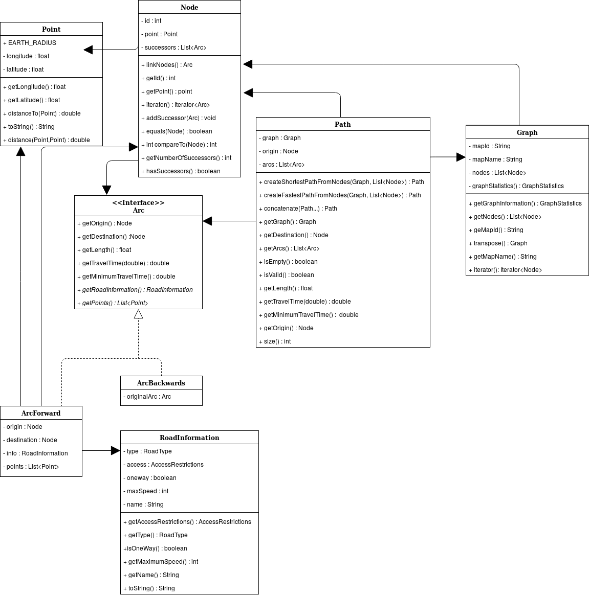

# Introduction 

Le but de ce Bureau d'étude est de nous faire découvrir les méthodes modernes de programmation utilisée en entreprise au travers de l'implémentation de deux algorithmes de recherches de chemin. Nous commençons par implémenter les structures de données nécessaires à leur implémentation (file de priorité) pour ensuite implémenter un algorithme de Dijkstra et un algorithme d'Astar. Enfin nous écrivons des tests unitaires pour vérifier l'implémentation de nos algorithmes.

Pour terminer ce Bureau d'étude il nous est demandé de réfléchir à un problème de graphe dit "ouvert".

# Documents de conception

Afin de se familiariser avec la librairie Java qui nous est fournie nous avons réalisé un graphe UML des différentes classes en rapport avec les graphes.
{width=70%}

## Label

### DijkstraLabel

Le `Label` pour l'algorithme de Dijkstra est assez simple, il contiens quatre membres :
* un booléen représente le fait qu'il soit marqué ou non
* le nœud parent par lequel il faut passer pour arriver à ce label
* le coût total pour arriver au label
* le nœud associé au label

```java
// ... classe Label
public boolean marked ;
public Node parent ;
public double cost ;
public Node me;
```

Ainsi pour comparer des `Label` on peut se contenter d'implémenter `Comparable<Label>` et de comparer le membre `Label::cost` :
```java
// ... classe Label
@Override
public int compareTo(Label label) {
        Double val = this.cost - label.cost;
        return val.intValue();
}
```

### AstarLabel

Nous avons eu beaucoup de mal a implémenté cette classe : nous voulions à la base hériter de `DijkstraLabel` mais cela nous empêché d'implémenter la comparaison entre deux label de manière correcte à cause des limitations du langage. C'est pourquoi nous avons dupliqué le code et rajouté un membre à la classe `DijkstraLabel` qui est de toutes façons très petite.
Les membres sont alors :
```java
// ... classe AstarLabel
public boolean marked ;
public Node parent ;
public double cost ;
public Node me;
// Nouveau membre pour le coût heuristique
public double estimatedGoalDistance ;
```

La comparaison est elle implémentée ainsi :
```java
@Override
public int compareTo(AstarLabel label) {
    return (int) Math.signum((this.cost + this.estimatedGoalDistance) - (label.cost + label.estimatedGoalDistance));
}
```

## Dijkstra

Notre algorithme est implémenté ainsi :

On commence par initialiser quelques variables utiles, notamment on initialise les `Label` à `null` pour ne pas consommer de la mémoire inutilement.

```java
ShortestPathData data = getInputData();
// Le résultat de l'algorithme
ShortestPathSolution solution = null;
Graph graph = data.getGraph();
final int nbNodes = graph.size();
boolean done = false ;
// Le tableau de label indexé par l'ID des nodes
ArrayList<Label> labels = new ArrayList<>(nbNodes);
for (int i = 0; i < nbNodes; i++) {
    labels.add(null);
}
```

Ensuite on crée le `Label` de l'origine et la file de priorité et on ajoute ledit `Label` à la file.

```java
Label labi = new Label(data.getOrigin(), null, false, 0.0);
labels.set(data.getOrigin().getId(), labi);

BinaryHeap<Label> tas= new BinaryHeap<>();
tas.insert(labels.get(data.getOrigin().getId()));
```

On peut maintenant exécuter l'algorithme ! On boucle sur `!done` et on sors de la boucle quand la file de priorité est vide.

```java
while (!done)
{
    if (tas.isEmpty()) {
        break;
    }
```
Sinon on récupère le prochain `Label` `x` à tester grâce à la file de priorité, et on le marque (aussi bien pour l'interface graphique que pour l'algorithme). Ensuite on vérifie si on est arrivé à destination.

```java
    Label x = tas.deleteMin();
    if(x.me.equals(data.getOrigin())){notifyOriginProcessed(x.me);}
    x.marked = true;
    notifyNodeMarked(x.me);
    if (x.me.equals(data.getDestination())) {
        done = true;
        notifyDestinationReached(x.me);
    }
```
On parcours les voisins `y` du nœud associé au `Label` et on alloue les `Label` quand c'est nécessaire.

```java
    Iterator<Arc> it = graph.get(x.me.getId()).iterator();

    while (it.hasNext())
    {
        Arc arc = it.next();
        Node y = arc.getDestination();
        Label label_y = labels.get(y.getId());
        // Allocation du label
        if (label_y == null) {
            labels.set(y.getId(), new Label(null, null, false, Double.POSITIVE_INFINITY));
            label_y = labels.get(y.getId());
        }
```

Ensuite, si le nœud n'est pas marqué et que l'on peut y aller on le met à jour.

```java

        if (!(label_y.marked) && !y.equals(x) && data.isAllowed(arc))
        {
            double AncienCout = labels.get(y.getId()).cost;
            double NewCout = labels.get(arc.getOrigin().getId()).cost + data.getCost(arc);
            notifyNodeReached(y);
            if (NewCout < AncienCout)
            {
                labels.get(y.getId()).me = y ;
                labels.get(y.getId()).cost = NewCout;
                labels.get(y.getId()).parent = x.me;
                try {
                    tas.remove(labels.get(y.getId()));
                }
                catch (ElementNotFoundException ignored){}

                tas.insert(labels.get(y.getId()));
            }
        }
    }
```

Ensuite on vérifie qu'il existe un `Label` non marqué sinon on arrête l'algorithme.

```java
    if (!done) {
        done = true;
        for (Label lab : labels) {
            if (lab == null || !lab.marked) {
                done = false;
                break;
            }
        }
    }
}
```

Lorsque la boucle sur `!done` est terminée on essaie de reconstruire le chemin de la solution.

```java
try {

    ArrayList<Node> result = new ArrayList<Node>();

    /* Création du chemin */
    Node current = data.getDestination();
    boolean done_rebuilding = false;
    while (! done_rebuilding) {
        result.add(current);
        current = labels.get(current.getId()).parent;

        if (current.equals(data.getOrigin())) {
            done_rebuilding = true;
            result.add(current);
        }
    }
    /* Inversion du chemin */
    for(int i = 0, j = result.size() - 1; i < j; i++) {
        result.add(i, result.remove(j));
    }

    Path sol_path = Path.createShortestPathFromNodes(graph, result);
    solution = new ShortestPathSolution(data, AbstractSolution.Status.FEASIBLE, sol_path);
    return solution;
}
catch (Exception e) {
    return new ShortestPathSolution(data, AbstractSolution.Status.INFEASIBLE, null);
}
```

## Astar

L'implémentation de l'Astar est la même que celle du Dijkstra sauf que l'on utilise des `AstarLabel` au lieu des `Label` normaux. Lors de l'allocation d'un `AstarLabel` le coût heuristique est donnée par la distance à vol d'oiseau entre le nœud associé à ce label et le but de l'algorithme.

# Tests unitaires

Pour les tests nous avons décidé d'essayer d'être le plus exhaustif possible c'est à dire que nous avons de nombreux cas de test.

Nous avons tout d'abord un test "manuel", c'est à dire que sur un graphe simple nous avons calculé à la main le résultat du Dijkstra pour tous les nœuds de départs et d'arrivées et nous avons vérifié (de manière automatique) que nos algorithmes" trouve les mêmes résultats. 

Dans le cas de la carte de Toulouse, nous vérifions que le Dijkstra, le Bellman-Ford et l'Astar trouve bien des solutions de la même longueur ou de la même durée si on fais une recherche en temps.

Pour cela nous avons commencé par écrire une routine de test :

```java
private void testShortestPathAlgorithm(Node u, Node i, Graph g, int arcInspectorId){
    // On récupère le filtre d'arc
    ArcInspector insp = ArcInspectorFactory.getAllFilters().get(arcInspectorId); 
    
    // Paramétrisation des algorithmes
    ShortestPathData data = new ShortestPathData(g, u, i, insp);
    
    //  Création des trois algorithmes
    DijkstraAlgorithm Dijk = new DijkstraAlgorithm(data);
    BellmanFordAlgorithm Bell = new BellmanFordAlgorithm(data);
    AStarAlgorithm Ast = new AStarAlgorithm(data);
    
    // Lancement des calculs
    ShortestPathSolution bell_sol = Bell.run();
    ShortestPathSolution djik_sol = Dijk.run();
    ShortestPathSolution ast_sol = Ast.run();

    // Vérification des solutions
    assertEquals(bell_sol.isFeasible(),djik_sol.isFeasible());
    assertEquals(bell_sol.isFeasible(), ast_sol.isFeasible());

    if (bell_sol.isFeasible()) {
        if (insp.getMode() == AbstractInputData.Mode.LENGTH) {
            assertEquals(bell_sol.getPath().getLength(), djik_sol.getPath().getLength(), 1e-6);
            assertEquals(djik_sol.getPath().getLength(), ast_sol.getPath().getLength(), 1e-6);
        }
        if (insp.getMode() == AbstractInputData.Mode.TIME) {
            assertEquals(bell_sol.getPath().getMinimumTravelTime(), djik_sol.getPath().getMinimumTravelTime(), 1e-6);
            assertEquals(djik_sol.getPath().getMinimumTravelTime(), ast_sol.getPath().getMinimumTravelTime(), 1e-6);
        }
    }
}
```

Cette routine compare le résultat des trois algorithmes en les lançant à partir du nœud `u` jusqu'au nœud `i` avec l'`ArcInspector` donné en argument.


Ensuite à l'aide de l'interface graphique nous avons déterminé des paires de nœuds qui nous semble intéressante et nous avons vérifié que les algorithmes se comportent bien correctement.
On a porté une attention toute particulière à :

* le fait que l'algorithme n'emprunte pas des chemins interdits (comme le pont réservé au bus à côté de l'INSA).
* le fait que la recherche du chemin le plus court ait un temps de trajet supérieur ou égal au résultat de la recherche du chemin le plus rapide, et inversement pour la longueur du chemin.
* que l'algorithme se comporte bien sur des chemins très long (traverser tout Toulouse)
* que l'algorithme se comporte correctement quand on lui donne un point d'origine égal à sa destination
* que l'algorithme ne trouve pas de chemins quand il n'y en a pas

Enfin, nous avons testé pour les 6 `ArcInspector` que les trois algorithmes trouve des résultats identiques sur 5 chemins que nous avons déterminé à la main.

Nous avons aussi rajouté un nouvel `ArcInspector` qui simule un déplacement à vélo.

```java
@Override
public boolean isAllowed(Arc arc) {
    return arc.getRoadInformation().getAccessRestrictions()
            .isAllowedForAny(AccessMode.BICYCLE, EnumSet.complementOf(EnumSet
                    .of(AccessRestriction.FORBIDDEN, AccessRestriction.PRIVATE)));
}

@Override
public double getCost(Arc arc) {
    return arc.getTravelTime(
            Math.min(getMaximumSpeed(), arc.getRoadInformation().getMaximumSpeed()));
}

@Override
public String toString() {
    return "Fastest path for bicycles";
}

@Override
public int getMaximumSpeed() {
    return 35;
}

@Override
public Mode getMode() {
    return Mode.TIME;
}
```

Cet `ArcInspector` supplémentaire nous a été très utile car grâce à lui nous avons pu trouver des problèmes très particuliers sur la carte de Toulouse et partager nos tests avec d'autres binômes.

Nous avons notamment eu un problème en partant du nœud *35052* et en allant au nœud *16597* sur `toulouse.mapgr`, qui semble être un problème sur le fichier de la carte de Toulouse.

En conclusion, nous avons eu une démarche de test visant à couvrir le plus de cas possibles de manière automatique et cela nous a permis de détecter très rapidement les régressions dans notre code. En effet il nous est arrivé de modifier le code de notre algorithme et avoir une suite de test toute prête nous a permis de vérifier que celui-ci marchait au moins aussi bien qu'avant.
De plus les tests nous ont permis de vérifier l'implémentation de l'Astar de manière automatique. Nous sommes donc très satisfait d'avoir passé du temps à écrire ces tests car cela a été un vrai gain de temps et nous avons très vite rentabilisé le temps passé à écrire des tests. 

# Tests de performance

TODO <3

# Problème ouvert

<3

# Conclusion

Durant ce Bureau d'étude nous avons pu découvrir les méthodes modernes de programmation : utilisation de Java 8, développement d'une suite de test, benchmark du code, etc. Nous avons aussi pu mettre en pratique le cours de programmation orienté objet (POO) en nous insérant au milieu d'un projet déjà construit. On a aussi réalisé un graphe `UML` des différentes classes du projet.
